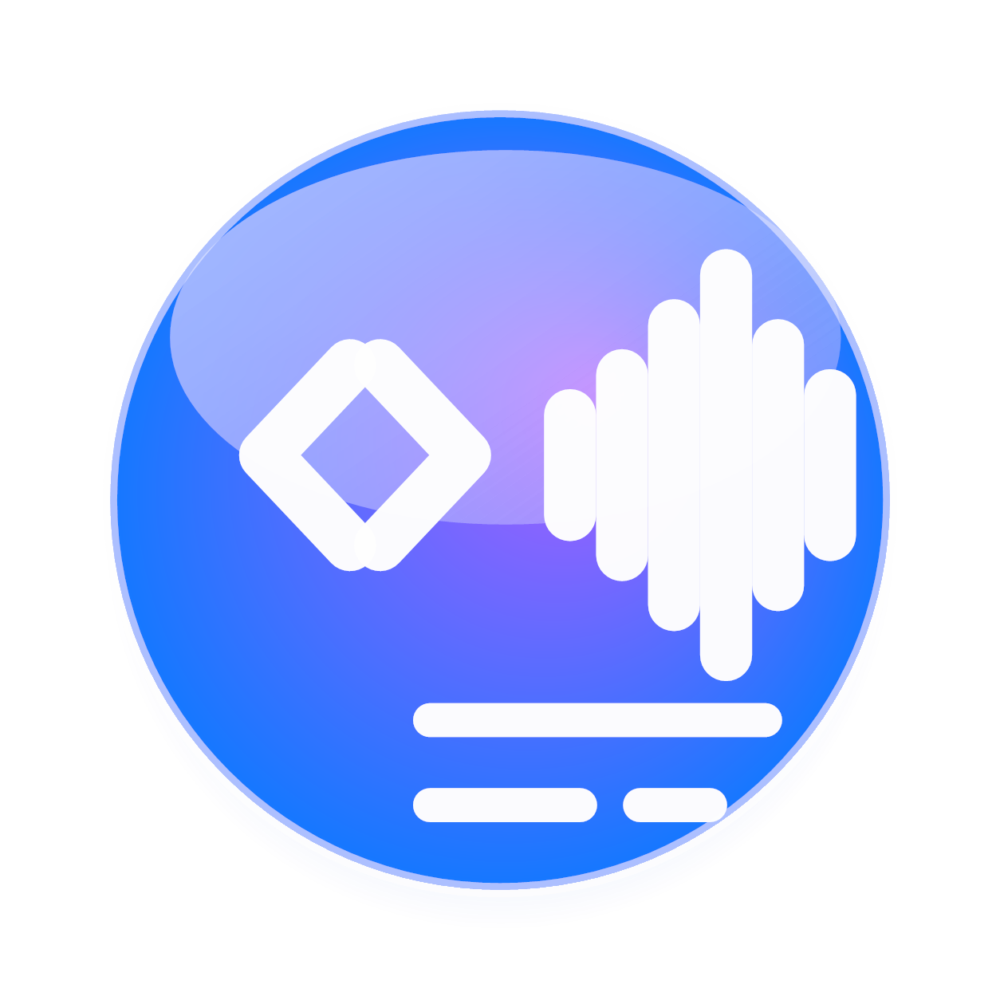
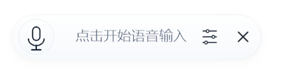
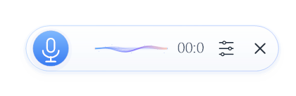
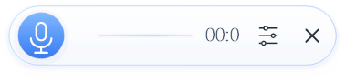
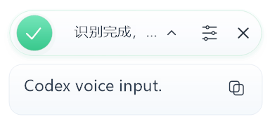

<p align="center">
  
</p>

<h1 align="center">Codex Voice Input</h1>

<p align="center">
  Windows 语音输入工具 / Codex 语音转文字输入法 / ChatGPT speech-to-text dictation for any Windows text box.
</p>

<p align="center">
  <a href="https://github.com/A3Boy/codex-voice-input/releases/latest"></a>
  <a href="https://github.com/A3Boy/codex-voice-input/actions/workflows/build.yml"></a>
  <a href="https://github.com/A3Boy/codex-voice-input/actions/workflows/release.yml"></a>
  <a href="./LICENSE"></a>
  
</p>

<p align="center">
  <a href="#中文">中文</a> · <a href="#english">English</a> ·
  <a href="https://github.com/A3Boy/codex-voice-input/releases/latest">Download</a>
</p>

> [!WARNING]
> Codex Voice Input 是非官方项目，与 OpenAI 无隶属、赞助或背书关系。项目复用逆向研究得到的 Codex Desktop 转写流程，不是公开稳定 API；如果 Codex Desktop 的认证、请求头或转写端点改变，本项目可能需要跟随更新。

## Search Keywords

Codex Voice Input, Codex ASR, Codex speech to text, Codex voice typing, ChatGPT speech to text, ChatGPT voice input, multilingual speech recognition, multilingual voice typing, Windows speech to text, Windows dictation app, Windows voice typing, 语音输入法, 语音转文字, 多语言语音识别, 多语种语音转文字, Windows 语音输入, Codex 语音转文字, ChatGPT 语音输入, ChatGPT 语音转文字, 任意输入框语音输入, Windows 浮动语音输入工具。

## Screenshots

<p align="center">
  
  
</p>
<p align="center">
  
  
</p>

# 中文

Codex Voice Input 是一个 Windows 桌面语音输入工具。它读取本机 Codex Desktop / Codex CLI 的登录状态，录制麦克风音频，调用 Codex Desktop 使用的 ChatGPT 转写端点，把语音转成文字，然后输入到当前光标所在的输入框。

它适合想把 Codex 的语音转文字能力变成「Windows 任意输入框语音输入法」的人：写文档、写代码注释、发聊天消息、记笔记、填网页表单，都可以通过全局快捷键快速录音、识别、输入。

## 核心特性

- Windows 全局语音输入：在浏览器、微信、编辑器、笔记软件、IDE、文档里都可以使用。
- 复用 Codex 登录：读取 `%USERPROFILE%\.codex\auth.json`，不需要单独配置 OpenAI API Key。
- Codex 多语种自动识别：不只中英，常见国家和地区语言、跨语言混说、技术词和产品名都由 Codex 转写端点自动判断。
- 浮动胶囊 UI：轻量置顶、可拖动、可贴边隐藏，适合长期驻留。
- 实时录音状态：麦克风音量驱动的动态波形，静音时显示基线。
- 识别结果预览：可以确认后输入，也可以复制识别文本。
- 识别历史：保留最近结果，方便回看和复制。
- 全局快捷键：默认 `Ctrl+Alt+Space`，支持在设置中修改。
- 单实例运行：避免多个托盘图标、多个快捷键监听和历史文件竞争。
- 自动清理临时录音：识别完成、失败、取消后删除录音文件，启动时清理旧 WAV。
- 自包含安装包：普通用户下载 `CodexVoiceInput-Setup.exe` 即可安装。

## 为什么选择 Codex 语音转文字

Codex Voice Input 的核心卖点不是“又一个录音按钮”，而是把 Codex 背后的转写能力变成一个随叫随到的 Windows 输入入口。你不用在不同软件之间复制粘贴，也不用先打开网页、上传音频、等待结果；只要光标在输入框里，按下快捷键，说话，文字就能进入当前工作流。

Codex 转写特别适合日常真实输入场景：

- 多语种自动匹配：中文、英文、日语、韩语、法语、德语、西班牙语等常见语言，以及跨语言混说、技术词、产品名和代码相关表达，都不需要手动选择语言。
- 口语转文字更自然：适合长句、自然停顿和连续表达，比传统命令式语音输入更接近“直接说想法”。
- 适合创作和编程语境：写需求、写注释、写 README、写提交说明、写聊天回复，都能保留比较自然的表达。
- 不打断当前窗口：悬浮胶囊常驻桌面，录音、识别、复制、输入都在一个轻量浮层里完成。
- 不需要 OpenAI API Key：复用本机 Codex 登录，把 Codex 用户已经拥有的能力直接变成桌面生产力工具。
- 自动识别输入结果：识别完成后先预览，可以一键输入，也可以复制文本，避免错误内容直接冲进当前输入框。
- 轻量但完整：全局快捷键、托盘、麦克风选择、历史记录、贴边隐藏、深色模式、自动清理录音都已经内置。

一句话：它把 Codex 的语音转文字能力从“隐藏在某个应用里的功能”变成“Windows 系统级的语音输入体验”。

## 下载与安装

### 方法一：下载安装包

前往 [Latest Release](https://github.com/A3Boy/codex-voice-input/releases/latest)，下载：

- `CodexVoiceInput-Setup.exe`：推荐，傻瓜式安装，创建开始菜单和桌面快捷方式。
- `CodexVoiceInput-win-x64.zip`：便携版，解压后运行 `CodexVoiceInput.exe`。

安装包和便携版都已经包含 .NET 8 与 Windows App SDK 运行组件，不需要用户额外安装运行时。

### 方法二：PowerShell 一行安装

```powershell
powershell -ExecutionPolicy Bypass -c "irm https://github.com/A3Boy/codex-voice-input/releases/latest/download/install.ps1 | iex"
```

安装脚本会下载 Windows x64 便携包，按 `SHA256SUMS.txt` 校验 ZIP 的 SHA-256，然后安装到：

```text
%LOCALAPPDATA%\Programs\CodexVoiceInput
```

## 快速开始

1. 安装并登录 Codex Desktop 或 Codex CLI。
2. 确认本机存在 `%USERPROFILE%\.codex\auth.json`。
3. 启动 Codex Voice Input。
4. 按 `Ctrl+Alt+Space` 开始录音。
5. 再按一次 `Ctrl+Alt+Space` 停止录音并转写。
6. 点击识别结果输入到当前焦点，或点击复制按钮复制文本。

## 常见使用场景

- Windows 语音输入法：在任意输入框中语音输入中文、英文或中英混合内容。
- ChatGPT 语音转文字：复用 Codex 登录，不单独购买官方转写 API。
- 写作与笔记：把口述内容快速转成文本，再进入编辑器整理。
- 编程辅助：口述注释、提交说明、需求说明、测试步骤。
- 即时聊天：在聊天软件、网页输入框和工单系统中快速输入长文本。

## 工作原理

Codex Desktop 会把录音发送到 ChatGPT 后端转写端点并返回文本。Codex Voice Input 将这个流程包装成一个 Windows 桌面输入工具：

1. 读取本机 Codex 登录令牌。
2. 使用 Windows 麦克风录制 WAV 音频。
3. 请求 `https://chatgpt.com/backend-api/transcribe`。
4. 显示识别结果。
5. 通过 Win32 输入模拟把文本写入当前焦点。

本项目参考并致谢 [Wangnov/codex-asr](https://github.com/Wangnov/codex-asr) 对 Codex 转写流程的研究。Codex Voice Input 不是 `codex-asr` 的包装器；桌面应用、UI、录音、快捷键、历史、输入和请求逻辑使用 C# 独立实现。

## 隐私与安全

Codex Voice Input 不运营中转服务器，不把录音或令牌发送给项目作者。

- Codex 登录令牌只从本机 `%USERPROFILE%\.codex\auth.json` 读取。
- 录音只发送到 ChatGPT 转写端点。
- 临时 WAV 文件会在完成、失败或取消后自动删除。
- 识别历史保存在本机 `%LOCALAPPDATA%\CodexVoiceInput\history.json`。
- 日志保存在本机，且会限制大小，避免无限增长。
- 不要在 Issue 中上传 `auth.json`、私人录音、识别历史或未经清理的日志。

更多安全边界见 [SECURITY.md](SECURITY.md)。

## 系统要求

- Windows 10 2004+ 或 Windows 11
- x64 设备
- 可用麦克风
- 本机已登录 Codex Desktop 或 Codex CLI
- 当前 Codex 订阅可以访问 Codex 转写能力
- 网络可以访问 `chatgpt.com`

## 已知限制

- 这是非官方逆向项目，不是 OpenAI 官方 API。
- Codex 转写端点可能变化，接口失效时需要跟随上游修复。
- 当前不是完整 TSF 输入法，输入文本依赖 Win32 `SendInput`。
- 某些管理员权限窗口、安全桌面或特殊输入控件可能无法注入文本。
- 目前只支持 Windows x64。

## 本地文件位置

```text
配置文件：%LOCALAPPDATA%\CodexVoiceInput\config.json
识别历史：%LOCALAPPDATA%\CodexVoiceInput\history.json
日志文件：%LOCALAPPDATA%\CodexVoiceInput\codex-voice-input.log
临时录音：%TEMP%\CodexVoiceInput
安装目录：%LOCALAPPDATA%\Programs\CodexVoiceInput
```

## 从源码构建

需要 Visual Studio 2022 或 Build Tools，并安装：

- .NET desktop development workload
- Windows SDK
- .NET 8 SDK

构建和运行：

```powershell
.\build.ps1 -Configuration Debug
.\run.ps1
```

运行测试：

```powershell
dotnet run --project .\tests\HotkeyContract\HotkeyContract.csproj
dotnet run --project .\tests\TextPostProcessorContract\TextPostProcessorContract.csproj
dotnet run --project .\tests\ClipboardContract\ClipboardContract.csproj
Get-ChildItem .\scripts\test-*-contract.ps1 | ForEach-Object { & $_.FullName }
```

打包：

```powershell
.\package.ps1
```

## FAQ

### 这是 OpenAI 官方项目吗？

不是。Codex Voice Input 是非官方开源项目，与 OpenAI 无隶属、赞助或背书关系。

### 需要 OpenAI API Key 吗？

不需要。项目复用本机 Codex 登录状态，不走官方 OpenAI API 转写路径。

### 为什么叫 Codex 逆向语音输入？

因为项目目标就是复用 Codex Desktop 的逆向转写接口，把它做成 Windows 语音输入工具。接口失效时，本项目会尽量跟随 Codex Desktop 更新，但不承诺长期稳定。

### 别的电脑能用吗？

可以，但需要满足 Windows x64、已安装应用、已在该电脑登录 Codex Desktop 或 Codex CLI，并且订阅可用。登录状态不会随安装包迁移。

### 录音文件会保留吗？

正常流程不会长期保留。识别完成、失败或取消后会自动删除当前录音；应用启动时也会清理旧临时 WAV。

## Roadmap

- 更稳定的第二次启动唤醒体验
- 更清晰的错误提示与恢复建议
- 更完善的截图和演示 GIF
- 更轻量的发布包体积

## 致谢

- [Wangnov/codex-asr](https://github.com/Wangnov/codex-asr)：Codex ASR 逆向研究参考。
- [NAudio](https://github.com/naudio/NAudio)：Windows 麦克风录音。
- Microsoft WinUI 3 / Windows App SDK：桌面 UI 与 Windows 集成。

## License

[MIT](LICENSE). Third-party notices are listed in [THIRD_PARTY_NOTICES.md](THIRD_PARTY_NOTICES.md).

---

# English

Codex Voice Input is an unofficial Windows voice typing and speech-to-text app for Codex users. It turns the reverse-engineered Codex Desktop transcription flow into a floating Windows dictation capsule: press a global hotkey, record your microphone, transcribe speech with the Codex / ChatGPT transcription endpoint, preview the text, and type it into the currently focused input box.

## Why Use Codex Voice Input?

- Windows speech to text for any text box.
- ChatGPT / Codex voice typing without configuring an OpenAI API key.
- Reuses the local Codex Desktop or Codex CLI login.
- Works as a lightweight floating dictation capsule.
- Supports result preview, copy, history, global hotkey, tray menu, microphone selection, and edge docking.

## What Makes Codex Transcription Useful?

Codex Voice Input is designed for real daily dictation, not just demo audio transcription. It brings Codex-style speech recognition into the active Windows app, so you can speak directly into documents, chats, browsers, editors, issue trackers, terminals, and IDEs.

- Automatic multilingual recognition: common languages across many countries and regions can be detected without picking a language first, including Chinese, English, Japanese, Korean, French, German, Spanish, mixed-language speech, technical terms, product names, and coding-related phrases.
- Natural long-form dictation: speak full thoughts, notes, replies, requirements, or documentation instead of short voice commands.
- Codex-friendly technical context: useful for code comments, README drafts, commit messages, bug reports, and developer notes.
- No OpenAI API key setup: it reuses the local Codex login already present on your Windows machine.
- Preview before typing: review the transcription, type it into the current field, or copy it for later.
- System-wide workflow: the floating capsule stays out of the way while still being one hotkey away.

In short, Codex Voice Input turns Codex transcription into a practical Windows voice typing layer.

## Download

Download the latest Windows release:

[https://github.com/A3Boy/codex-voice-input/releases/latest](https://github.com/A3Boy/codex-voice-input/releases/latest)

Recommended asset:

- `CodexVoiceInput-Setup.exe` for a normal desktop installation.
- `CodexVoiceInput-win-x64.zip` for portable usage.

Verified PowerShell installer:

```powershell
powershell -ExecutionPolicy Bypass -c "irm https://github.com/A3Boy/codex-voice-input/releases/latest/download/install.ps1 | iex"
```

## Requirements

- Windows 10 2004+ or Windows 11 x64
- A working microphone
- Local Codex Desktop or Codex CLI authentication at `%USERPROFILE%\.codex\auth.json`
- A Codex subscription that can access the transcription flow
- Network access to `chatgpt.com`

## How It Works

1. Reads the local Codex authentication file.
2. Records microphone audio on Windows.
3. Sends the WAV audio to `https://chatgpt.com/backend-api/transcribe`.
4. Shows a transcription preview.
5. Types the recognized text into the active Windows input field with Win32 input simulation.

This project is inspired by the Codex ASR research in [Wangnov/codex-asr](https://github.com/Wangnov/codex-asr), but it is not a Rust wrapper and does not call the `codex-asr` executable. The Windows application is implemented independently in C#.

## Security and Privacy

Codex Voice Input does not run a relay server. Authentication and history stay on your machine, and audio is sent directly to the ChatGPT transcription endpoint.

Do not upload Codex auth files, private audio, recognition history, or raw logs to GitHub issues. See [SECURITY.md](SECURITY.md).

## Disclaimer

This is not an official OpenAI product or API. It is not affiliated with, endorsed by, or sponsored by OpenAI. The reverse-engineered endpoint can change without notice.

## License

[MIT](LICENSE). See [THIRD_PARTY_NOTICES.md](THIRD_PARTY_NOTICES.md) for attribution.
